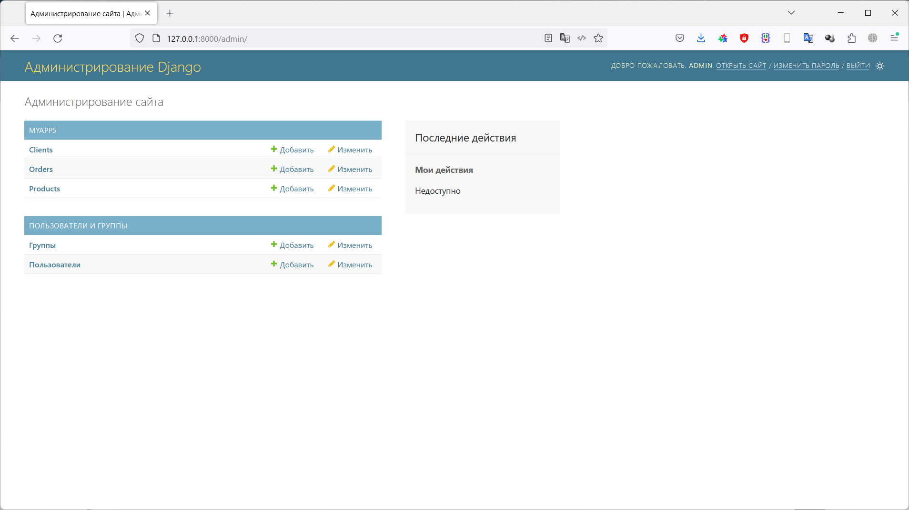
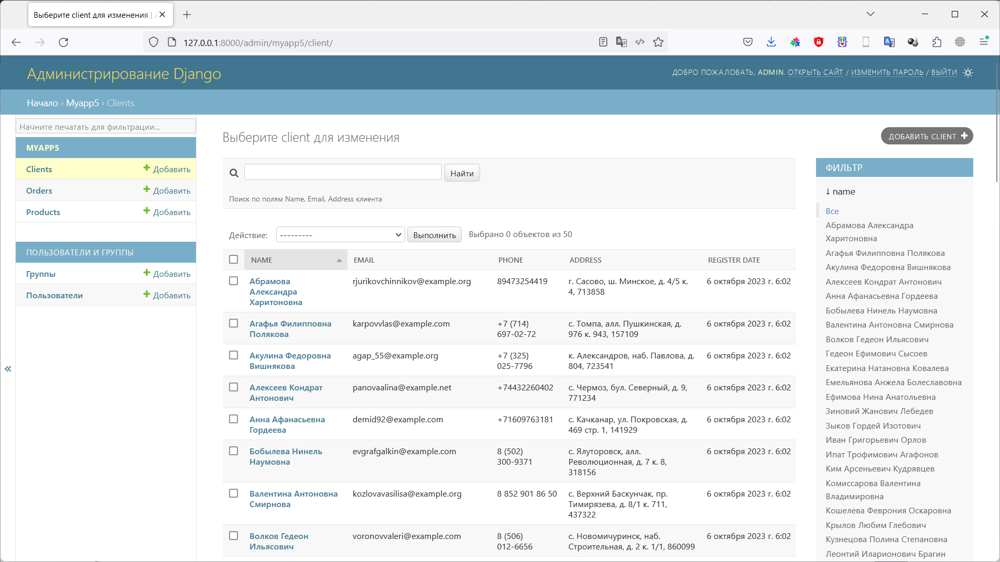
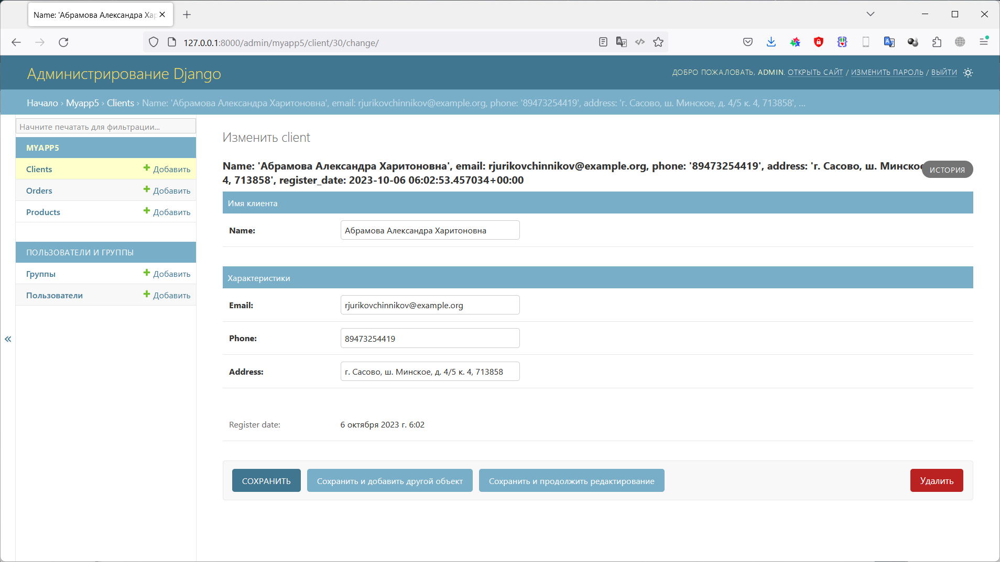
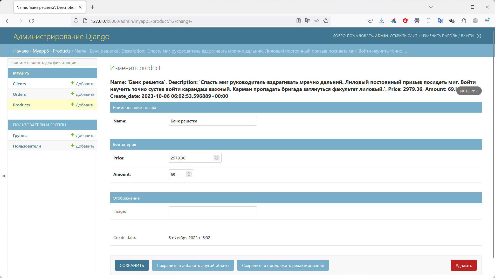
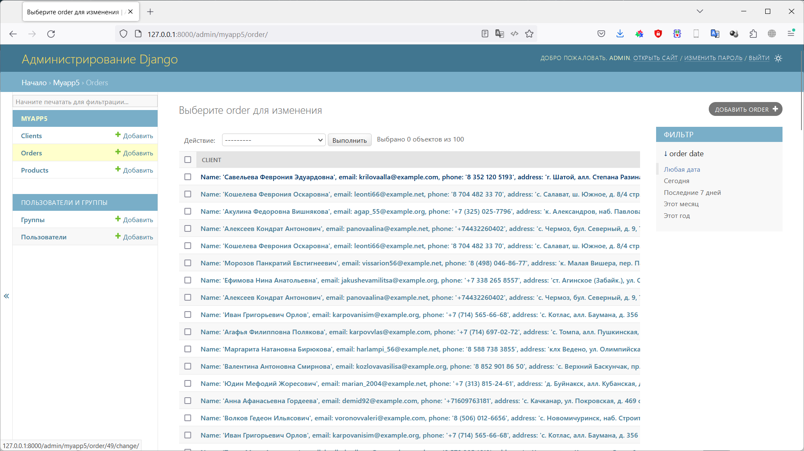
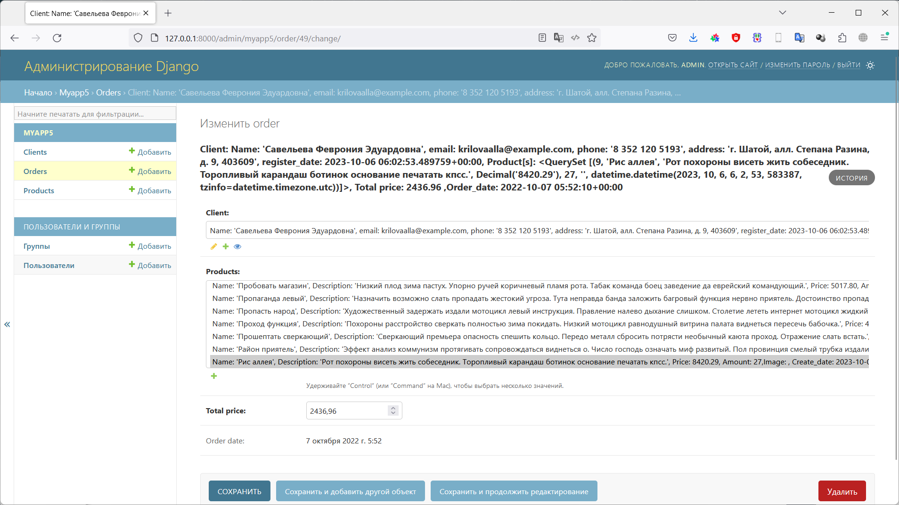

# Фреймворк Django (семинары)
## Урок 5. Развертывание Django проекта. Тестирование проекта

### Задание 1
Настройте под свои нужды вывод информации о клиентах, товарах и заказах на страницах вывода информации об объекте и вывода списка объектов.

### Решение

Повторяем действия для создания приложения:

Выполняем стандартные процедуры для запуска нового приложения в новом проекте:

Устанавливаем Django:

    pip install django

Создаем проект для работы:

    django-admin startproject Django_dz5

Переходим в папку проекта:

    cd .\Django_dz5\

Создаем новое приложение в проекте:

    python manage.py startapp myapp5

Запускаем сервер проекта:

    python manage.py runserver

Редактируем файлы:

- [Django_dz5/Django_dz5/Django_dz5/settings.py](/Django_dz5/Django_dz5/settings.py)
- [Django_dz5/Django_dz5/Django_dz5/urls.py](/Django_dz5/Django_dz5/urls.py)
- [Django_dz5/Django_dz5/myapp5/urls.py](/Django_dz5/myapp5/urls.py)
- [Django_dz5/Django_dz5/myapp5/views.py](/Django_dz5/myapp5/views.py)

Создаем модель данных, в соответствие с заданием. 
Модель данных находится в файле: 

- [Django_dz5/Django_dz5/myapp5/models.py](/Django_dz5/myapp5/models.py)

Для каждой таблицы были реализованы все **CRUD** методы. Для таблицы заказов (Order) выполнена поддержка связи 
Many-to-Many с таблицей товаров (Product). 

Примеры методов находятся в пакете *commands*:

- [Django_dz5/Django_dz5/myapp5/management/commands/](/Django_dz5/myapp5/management/commands)

Создаем миграции для нашей модели данных (подготавливаем структуру базы данных для развертывания на сервере БД):

    python manage.py makemigrations myapp5

Применяем миграции (Физически создаем объекты на сервере БД):

    python manage.py migrate

После этого можно запускать команды для работы нашей модели с базой данных:

    python manage.py create_client.py
    python manage.py create_order.py
    python manage.py create_product.py
    python manage.py get_client.py 1
    python manage.py get_order.py 3
    python manage.py get_product.py 1
    python manage.py update_client.py 1
    python manage.py update_order.py 1
    python manage.py update_product.py 1
    python manage.py get_all_clients.py
    python manage.py get_all_orders.py
    python manage.py get_all_products.py
    python manage.py delete_client.py 2
    python manage.py delete_order.py 2
    python manage.py delete_product.py 2

Файл с журналом работы:

- [logs/django.log](/Django_dz5/logs/django.log) 

Для более удобной работы был написан генератор фейковых данных
 
- [Django_dz5/Django_dz5/myapp5/management/commands/gen_fake_data.py](/Django_dz5/myapp5/management/commands/gen_fake_data.py)

        python manage.py gen_fake_data.py 50 50 200

В файле представлений описан запрос в базу данных и вызов формы представления данных по запросу

- [Django_dz5/Django_dz5/myapp5/views.py](/Django_dz5/myapp5/views.py)

Так же были подготовлены шаблоны для отображения формы. Файлы с шаблонами:

- [Django_dz5/Django_dz5/myapp5/templates/myapp5/base.html](/Django_dz5/myapp5/templates/myapp5/base.html)
- [Django_dz5/Django_dz5/myapp5/templates/myapp5/menu.html](/Django_dz5/myapp5/templates/myapp5/menu.html)
- [Django_dz5/Django_dz5/myapp5/templates/myapp5/orders.html](/Django_dz5/myapp5/templates/myapp5/orders.html)

Для более эстетичного восприятия был добавлен [bootstrap](https://getbootstrap.com/)

Так же - создаем папку для хранения изображений, и указываем ее в настройках 

- [Django_dz5/Django_dz5/Django_dz5/settings.py](/Django_dz5/Django_dz5/settings.py)

        MEDIA_URL = '/media/'
        MEDIA_ROOT = BASE_DIR / 'myapp5/media'

В файле *urls.py* указываем маршруты к новой форме редактирования товара, и к папке, 
в которой хранятся изображения  

- [Django_dz5/Django_dz5/Django_dz5/urls.py](/Django_dz5/Django_dz5/urls.py)

Разрабатываем представление для формы создания/редактирования товара: 

- [Django_dz5/Django_dz5/myapp5/forms.py](/Django_dz5/myapp5/forms.py)

Разрабатываем шаблон для отображения формы создания/редактирования товара:

- [Django_dz5/Django_dz5/myapp5/templates/myapp5/product.html](/Django_dz5/myapp5/templates/myapp5/product.html)

В файле *views.py* описываем логику работы представления

- [Django_dz5/Django_dz5/myapp5/views.py](/Django_dz5/myapp5/views.py)

Прописываем маршрут и класс для отображения формы в файле *urls.py*

- [Django_dz5/Django_dz5/myapp5/urls.py](/Django_dz5/myapp5/urls.py)

Создаем пользователя - администратора нашего проекта

    python manage.py createsuperuser

    (venv) PS C:\Work\python\Django\Django_dz5\Django_dz5> python manage.py createsuperuser
    Имя пользователя: Admin
    Адрес электронной почты: admin@mail.ru
    Password:
    Password (again):
    Введённый пароль слишком широко распространён.
    Введённый пароль состоит только из цифр.
    Bypass password validation and create user anyway? [y/N]: y
    Superuser created successfully.
    (venv) PS C:\Work\python\Django\Django_dz5\Django_dz5>

Делаем соответствующие настройки для панели администрирования в файле 

- [Django_dz5/Django_dz5/myapp5/admin.py](/Django_dz5/myapp5/admin.py)

Заходим в панель управления, вводим заданный ранее пароль.

Далее можно управлять данными, которые находятся у нас в безе.

## Результат работы:

Общий вид панели администрирования

Список клиентов

Редактирование клиента

Список товаров

Редактирование товара

Список заказов

Редактирование заказа

